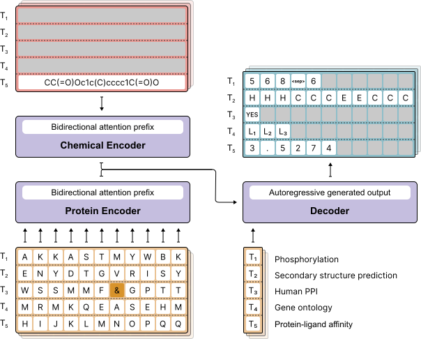

<div align="center">
<h2>Prot2Token: A multi-task framework for protein language processing using autoregressive language modeling</h2>

**Mahdi Pourmirzaei**<sup>1&dagger;</sup> · **Farzaneh Esmaili**<sup>1 </sup> · **Mohammadreza Pourmirzaei**<sup>
2 </sup> · **Duolin Wang** <sup>1</sup> · **Dong Xu**<sup>1*</sup>

<sup>1</sup>University of Missouri&emsp;&emsp;&emsp;&emsp;<sup>2</sup>Politecnico di Milano

&dagger;project lead&emsp;*corresponding author

**ICML 2024**

<p align="center">
    
</p>
<a href="https://www.biorxiv.org/content/10.1101/2024.05.31.596915v1">.svg' alt='Paper PDF'></a>
</div>

This is the official repository of Prot2Token paper.

<p align="center" style="text-align:justify">
<strong>Abstract</strong>: This paper proposes a versatile tokenization method and introduces Prot2Token, a model that combines
autoregressive language modeling with protein language models (PLMs) to tackle various protein prediction tasks using
protein sequences. Leveraging our tokenization method, Prot2Token adapts existing PLMs for multiple tasks such as
protein-level prediction, residue-level prediction, and protein-protein interaction prediction through next-token
prediction of tokenized target label sequences. By incorporating prompt tokens into the decoder, Prot2Token enables
multi-task training in a single end-to-end session. Our results demonstrate that Prot2Token not only matches
the performance of specialized models across various tasks but also paves the way for integrating protein tasks
with large language models (LLMs), representing an important step towards creating general-purpose PLMs for advanced
protein language processing (PLP). Additionally, we use Prot2Token to develop S-ESM, a structure-aware version of
the ESM model, which achieves competitive performance with state-of-the-art methods in 3D structure-related tasks using
only protein sequences. </p>

<p align="center"></p>

[](https://youtu.be/YxYzR6zoxSM)

# To Do

- [x] Add the code for the Prot2Token model
- [x] Save decoder tokenizer in saving directory
- [x] Add inference code
- [x] Add the pre-trained models to use them for prediction
- [x] Add datasets
- [x] Continue training of a pre-trained model on new tasks with new vocab sizes

# Usage

To use Prot2Token, you can either install the package directly for quick prediction usage or set up the full repository
for development.

# Package
## Installation

To install the package, you can run the following command:

```commandline
pip install prot2token
```

## Prediction Tutorial
To use the Prot2Token package for making predictions, follow the example code snippet below:

```python
from prot2token.models import prepare_models

net = prepare_models(name='fluorescence', device='cuda', compile_model=True)

samples = ["MVLSEGEWQLVLHVWAKVEADVAGHGQDILIRLFKSHPETLEKFDRVKHLKTEAEMKASEDLKKAGVTVLTALGAILKKKGHHEAELKPLAQSHATKHKIPIKYLEFISEAIIHVLHSRHPGNFGADAQGAMNKALELFRKDIAAKYKELGYQG"]

results = net.run(samples, merging_character='')
print(results)

```

And the results will be like the following:

```commandline
[['MVLSEGEWQLVLHVWAKVEADVAGHGQDILIRLFKSHPETLEKFDRVKHLKTEAEMKASEDLKKAGVTVLTALGAILKKKGHHEAELKPLAQSHATKHKIPIKYLEFISEAIIHVLHSRHPGNFGADAQGAMNKALELFRKDIAAKYKELGYQG', '<task_fluorescence>', '1.8003']]
```
# Development
## Installation

Clone the repository and navigate into the directory:

```
git clone git@github.com:mahdip72/prot2token.git
cd prot2token
```

To use this project, do as the following to install the dependencies.

1. Create a new environment using: `conda create --name myenv python=3.8`.
2. Activate the environment you have just created: `conda activate myenv`.
3. Make the install.sh file executable by running the following command `chmod +x install.sh`.
4. Finally, run the following command to install the required packages inside the conda environment:

```commandline
bash install.sh
```

## Dataset

You can download the datasets
from [this](https://mailmissouri-my.sharepoint.com/:f:/g/personal/mpngf_umsystem_edu/EplpatYuvHlNpsRUL9oAknwB2UKActKh7P3veMGe8DDuSw?e=U8hiFF)
link. Then, set up the directory of the datasets folder in the `configs/config.yaml` file, data_path names like the
following:

```yaml
train_settings:
  skip: False
  data_path: <path_to_datasets_folder>
  ...

valid_settings:
  data_path: <path_to_datasets_folder>
  ...

test_settings:
  enable: True
  data_path: <path_to_datasets_folder>
  ```

All the datasets that we used in the project can be found in the datasets folder. They are preprocessed and ready to
use.
You can use them to train the model.

## Training

To utilize the accelerator power in you training code such as distributed multi GPU training, you have to set
the accelerator config by running `accelearte config` in the command line.
Then, you have to set the training settings and hyperparameters inside the `configs/config.yaml` file.
Finally,
you can start your training by running the following command:

```commandline
accelerate launch train.py --config_path configs/<config_name>
```

You might not use accelerator to run the `train.py` script if you just want to **debug** your script on single GPU. If
so, simply after setting the `config.yaml` file
run the code by `python train.py`. It should be noted that accelerate supports both single gpu and distributed
training. So, you can use it for your final training.

## Inference

To run the inference code for a pre-trained model on a set of sequences, first you have to set the
`inference_config.yaml` file. You need to have access to the result directory of the pre-trained model
including best checkpoint and config file to be able to run the inference code (refer to pre-trained models section)
The `inference_config.yaml` file is set as the following:

```yaml
checkpoint_path: /path/to/checkpoint.pth
result_config_path: /path/to/config.yaml
decoder_tokenizer_path: /path/to/decoder_tokenizer.yaml
result_path: /path/to/inference/results/
data_path: /path/to/inference/data.csv

compile_model: False
tqdm_progress_bar: True
fix_seed: 0
batch_size: 1
num_workers: 0
  ```

For data_path, you need to set the path to a csv file that contains the data you want to run the inference on. The csv
file need to have the following columns:

```csv
input, task_name
```

Then, run the following command:

```commandline
accelerate launch inference.py --config_path configs/<inferenece_config_name>
```

After running the inference code, you can find the results in the `inference_results.csv` file in `result_path`
directory that you have set in the `inference_config.yaml` file.

## Pretrained Models

In the following table, you can find the pre-trained models that we have used in the paper. You can download them from
the following links:

| Model Name | Task                 | Auxiliary Tasks |Download Link                                                                                                                                            |
|------------|----------------------|-----------------|----------------------------------------------------------------------------------------------------------------------------------------------------------|
| Prot2Token | Fluorescence         | PLA             |[Download](https://mailmissouri-my.sharepoint.com/:f:/r/personal/mpngf_umsystem_edu/Documents/Github/Prot2Token/pre-trained_models?csf=1&web=1&e=32q99b) |
| Prot2Token | Stability            | -               |[Download](https://mailmissouri-my.sharepoint.com/:f:/r/personal/mpngf_umsystem_edu/Documents/Github/Prot2Token/pre-trained_models?csf=1&web=1&e=32q99b) |
| Prot2Token | Deeploc Localization | -               |[Download](https://mailmissouri-my.sharepoint.com/:f:/r/personal/mpngf_umsystem_edu/Documents/Github/Prot2Token/pre-trained_models?csf=1&web=1&e=32q99b) |

We will add more pre-trained models in the future.

## Important Considerations

When using this repository, please keep the following points in mind:

- **Model Size and Memory Requirements**: The Prot2Token model is quite large and requires significant memory for
  training, particularly if you plan to train multiple tasks on large ESM models. For example, our training process for
  the most extensive multitask settings utilized 4xA100 GPUs with 80GB memory and took approximately 4 days.

- **Robustness and Commercial Use**: This model is currently not robust enough for commercial use. The work presented
  here is a demonstration of the concept and the model, and further work is needed to make it practical.

- **Current Implementation Issues**: There are some issues with the current implementation that need to be addressed in
  future work. For instance, in sequence-to-sequence tasks like secondary structure prediction, the model sometimes
  produces sequences with a different number of tokens compared to the input sequences. We attempted to resolve this
  issue by carefully tuning the model hyperparameters and jointly training on multiple tasks, but it is not completely
  resolved.

- **Potential Improvements**: For certain tasks, such as protein-protein interaction and PTM prediction that need a
  unique tokenization strategy, based on our observation from adding auxiliary tasks, we assume as a fact that
  we could replace the randomly initialized decoder part of Prot2Token with a pre-trained language model like LLaMA.
  This idea is inspired by many works like Prot2Text. Indeed, the tokenization formats of these tasks demand the
  learning of implicit structural inductive biases from a substantial volume of text data, which may not be directly
  related
  to the original tasks. LLMs, having been trained on extensive data, possess a wealth of general information that makes
  them suitable as a starting point.

You can find the detailed information about the model and the results in the paper.
Here is an overview of the model architecture:

<p align="center"></p>

## 📜 Citation

If you use this code or the pretrained models, please cite the following paper:

```bibtex
@article {Pourmirzaei2024.05.31.596915,
	author = {Pourmirzaei, Mahdi and Esmaili, Farzaneh and Pourmirzaei, Mohammadreza and Wang, Duolin and Xu, Dong},
	title = {Prot2Token: A multi-task framework for protein language processing using autoregressive language modeling},
	year = {2024},
	doi = {10.1101/2024.05.31.596915},
	journal = {bioRxiv}
}
```
