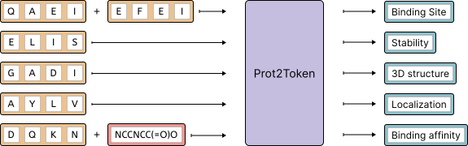
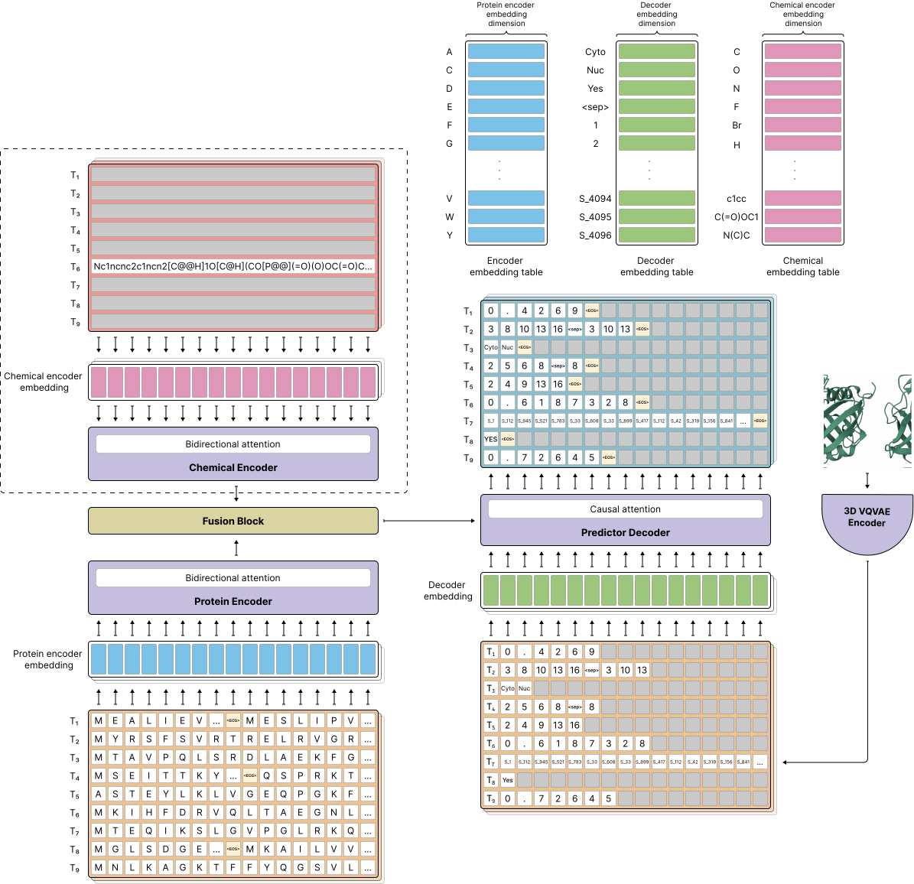

<div align="center">
<h2>Prot2Token: A Unified Framework for Protein Modeling via Next-Token Prediction</h2>

<p align="center">
    
</p>
<a href="https://arxiv.org/abs/2505.20589"></a>
</div>

This is the official repository of Prot2Token paper.


<p align="center" style="text-align:justify">
<strong>Abstract</strong>: The diverse nature of protein prediction tasks has traditionally necessitated specialized 
models, hindering the development of broadly applicable and computationally efficient Protein Language Models (PLMs). 
In this work, we introduce Prot2Token, a unified framework that overcomes these challenges by converting a wide
spectrum of protein-related predictions, from sequence-level properties and residue-specific attributes to complex 
inter-protein interactions, into a standardized next-token prediction format. At its core, Prot2Token employs an 
autoregressive decoder, conditioned on embeddings from pre-trained protein encoders and guided by learnable task 
tokens, to perform diverse predictions. This architecture uniquely facilitates multi-task learning, enabling a
single model to master numerous tasks with improved efficiency. We present extensive experimental validation 
across a variety of benchmarks, demonstrating Prot2Tokens strong predictive power in different types of 
protein-prediction tasks. Key results include significant speedups (e.g., near 1000x over AlphaFold2 with MSA) 
and performance often matching or exceeding specialized approaches. Beyond that, we introduce an auxiliary 
self-supervised decoder pre-training approach to improve spatially sensitive task performance. Prot2Token thus offers
a significant step towards a versatile, high-throughput paradigm for protein modeling, promising to accelerate 
biological discovery and the development of novel therapeutics. </p>

<p align="center"></p>

# News

- *17/06/2024**: The preprint version of our work **Prot2Token: A multi-task framework for protein language processing
  using autoregressive language modeling** has been published in ICML AccMLBio. You can find the preprint version
  on [bioRxiv](https://www.biorxiv.org/content/10.1101/2024.05.31.596915v1).
- **13/11/2024**: prot2token package has been released on PyPI. You can install it by running `pip install prot2token`.
- **22/03/2025**: Add two new tasks to python package: **kinase-group classification** and **kinase phosphorylation site
  prediction**.
- **22/03/2025**: The preprint version of our new work **Predicting Kinase-Substrate Phosphorylation Site Using
  Autoregressive Transformer** has been published. You can find the preprint version
  on [bioRxiv](https://www.biorxiv.org/content/10.1101/2025.03.12.642740v1).
- **22/03/2025**: Our new paper **Using Autoregressive-Transformer Model for Protein-Ligand Binding Site Prediction**
  has been accepted in ICLR 2025 LMRL. You can find the paper
  on [bioRxiv](https://www.biorxiv.org/content/10.1101/2025.03.11.642700v1).
- **22/03/2025**: Our new paper **Extending Prot2Token** has been accepted in ICLR 2025 LMRL. You can find the preprint
  version on [bioRxiv](https://www.biorxiv.org/content/10.1101/2025.03.03.641065v1).
- **29/05/2025**: A new preprint version of our work Prot2Token has been published
  on [arxiv](https://arxiv.org/abs/2505.20589).

# To Do

- [x] Add the code for the Prot2Token model
- [x] Save decoder tokenizer in saving directory
- [x] Add inference code
- [x] Add the pre-trained models to use them for prediction
- [x] Add datasets
- [x] Continue training of a pre-trained model on new tasks with new vocab sizes
- [x] Add melting temperature prediction task to the package
- [ ] Add mutation stability prediction task to the package
- [x] Updated version of substrate-kinase phosphorylation site prediction model

# license

The Prot2Token repository and the pre-trained models are provided ONLY for research purposes and are not intended for
commercial use.
If you are interested in using these models and technology commercially, please contact the University of Missouri
Technology Transfer Office (techadvancement@missouri.edu) for licensing inquiries.

# Usage

To use Prot2Token, you can either install the package directly for quick prediction usage or set up the full repository
for development.

# Package

## Installation

To install the package, you can run the following command:

```commandline
pip install prot2token
```

## List of Available Tasks

The Prot2Token package currently supports the following tasks:

| Task Name                   | Description                                                         | Type of Task               |
|-----------------------------|---------------------------------------------------------------------|----------------------------|
| fluorescence                | Predicts the fluorescence of a protein sequence.                    | Regression                 |
| stability                   | Predicts the stability of a protein sequence.                       | Regression                 |
| deeploc localization        | Predicts the subcellular localization of a protein sequence.        | Multi-label classification |
| kinase group classification | Classifies the kinase group of a protein sequence.                  | Multi-label classification |
| kinase phosphorylation site | Predicts phosphorylation sites given substrate and kinase sequences.| Other (PTM prediction) |
| melting temperature         | Predicts the melting temperature of a protein sequence.             | Regression                 |

[//]: # ([//]: &#40;| mutation stability          | Predicts the stability of a protein sequence after mutation.        |&#41;)

## Prediction Tutorial

To use the Prot2Token package for making predictions, follow the example code snippet below:

```python
from prot2token.models import prepare_models

net = prepare_models(name='fluorescence', device='cuda', compile_model=True)

samples = [
    "MVLSEGEWQLVLHVWAKVEADVAGHGQDILIRLFKSHPETLEKFDRVKHLKTEAEMKASEDLKKAGVTVLTALGAILKKKGHHEAELKPLAQSHATKHKIPIKYLEFISEAIIHVLHSRHPGNFGADAQGAMNKALELFRKDIAAKYKELGYQG"]

results = net.run(samples, merging_character='')
print(results)

```

for kinase phosphorylation site prediction task you need to have both substrate and kinase sequences as input:

```python
from prot2token.models import prepare_models

net = prepare_models(name='kinase_phosphorylation_site', device='cuda', compile_model=True)

samples = [
    ("MEVRPKESWNHADFVHCEDTESVPGKPSVNADEEVGGPQICRVCGDKATGYHFNVMTCEGCKGFFRRAMKRNARLRCPFRKGACEITRKTRRQCQACRLRKCLESGMKKEMIMSDEAVEERRALIKRKKSERTGTQPLGVQGLTEEQRMMIRELMDAQMKTFDTTFSHFKNFRLPGVLSSGCELPESLQAPSREEAAKWSQVRKDLCSLKVSLQLRGEDGSVWNYKPPADSGGKEIFSLLPHMADMSTYMFKGIISFAKVISYFRDLPIEDQISLLKGAAFELCQLRFNTVFNAETGTWECGRLSYCLEDTAGGFQQLLLEPMLKFHYMLKKLQLHEEEYVLMQAISLFSPDRPGVLQHRVVDQLQEQFAITLKSYIECNRPQPAHRFLFLKIMAMLTELRSINAQHTQRLLRIQDIHPFATPLMQELFGITGS",
     'MENFQKVEKIGEGTYGVVYKARNKLTGEVVALKKIRLDTETEGVPSTAIREISLLKELNHPNIVKLLDVIHTENKLYLVFEFLHQDLKKFMDASALTGIPLPLIKSYLFQLLQGLAFCHSHRVLHRDLKPQNLLINTEGAIKLADFGLARAFGVPVRTYTHEVVTLWYRAPEILLGCKYYSTAVDIWSLGCIFAEMHLVGTQHHARCCGEHRRNGRQSLCPLCSYLEVAASQGWGMTAVSTPYPVTRRALFPGDSEIDQLFRIFRTLGTPDEVVWPGVTSMPDYKPSFPKWARQDFSKVVPPLDEDGRSLLSQMLHYDPNKRISAKAALAHPFFQDVTKPVPHLRL')]

results = net.run(samples, merging_character=',')

```

You can also get back the model confidence for metrics calculation. You need to set the `return_confidence` parameter:

```python
results = net.run(samples, merging_character=',', return_confidence=True)
```

# Development

## Installation

Clone the repository and navigate into the directory:

```
git clone git@github.com:mahdip72/prot2token.git
cd prot2token
```

To use this project, do as the following to install the dependencies.

1. Create a new environment using: `conda create --name myenv python=3.8`.
2. Activate the environment you have just created: `conda activate myenv`.
3. Make the install.sh file executable by running the following command `chmod +x install.sh`.
4. Finally, run the following command to install the required packages inside the conda environment:

```commandline
bash install.sh
```

## Dataset

You can download the datasets
from [this](https://mailmissouri-my.sharepoint.com/:f:/g/personal/mpngf_umsystem_edu/EplpatYuvHlNpsRUL9oAknwB2UKActKh7P3veMGe8DDuSw?e=U8hiFF)
link. Then, set up the directory of the datasets folder in the `configs/config.yaml` file, data_path names like the
following:

```yaml
train_settings:
  skip: False
  data_path: <path_to_datasets_folder>
  ...

valid_settings:
  data_path: <path_to_datasets_folder>
  ...

test_settings:
  enable: True
  data_path: <path_to_datasets_folder>
  ```

All the datasets that we used in the project can be found in the datasets folder. They are preprocessed and ready to
use.
You can use them to train the model.

## Training

To utilize the accelerator power in you training code such as distributed multi GPU training, you have to set
the accelerator config by running `accelearte config` in the command line.
Then, you have to set the training settings and hyperparameters inside the `configs/config.yaml` file.
Finally,
you can start your training by running the following command:

```commandline
accelerate launch train.py --config_path configs/<config_name>
```

You might not use accelerator to run the `train.py` script if you just want to **debug** your script on single GPU. If
so, simply after setting the `config.yaml` file
run the code by `python train.py`. It should be noted that accelerate supports both single gpu and distributed
training. So, you can use it for your final training.

## Inference

To run the inference code for a pre-trained model on a set of sequences, first you have to set the
`inference_config.yaml` file. You need to have access to the result directory of the pre-trained model
including best checkpoint and config file to be able to run the inference code (refer to pre-trained models section)
The `inference_config.yaml` file is set as the following:

```yaml
checkpoint_path: /path/to/checkpoint.pth
result_config_path: /path/to/config.yaml
decoder_tokenizer_path: /path/to/decoder_tokenizer.yaml
result_path: /path/to/inference/results/
data_path: /path/to/inference/data.csv

compile_model: False
tqdm_progress_bar: True
fix_seed: 0
batch_size: 1
num_workers: 0
  ```

For data_path, you need to set the path to a csv file that contains the data you want to run the inference on. The csv
file need to have the following columns:

```csv
input, task_name
```

Then, run the following command:

```commandline
accelerate launch inference.py --config_path configs/<inferenece_config_name>
```

After running the inference code, you can find the results in the `inference_results.csv` file in `result_path`
directory that you have set in the `inference_config.yaml` file.


## Important Considerations

When using this repository, please keep the following points in mind:

- **Model Size and Memory Requirements**: The Prot2Token model is quite large and requires significant memory for
  training, particularly if you plan to train multiple tasks on large ESM models. For example, our training process for
  the most extensive multitask settings utilized 4xA100 GPUs with 80GB memory and took approximately 4 days.

- **Robustness and Commercial Use**: This model is currently not robust enough for commercial use. The work presented
  here is a demonstration of the concept and the model, and further work is needed to make it practical.

- **Current Implementation Issues**: There are some issues with the current implementation that need to be addressed in
  future work. For instance, in sequence-to-sequence tasks like secondary structure prediction, the model sometimes
  produces sequences with a different number of tokens compared to the input sequences. We attempted to resolve this
  issue by carefully tuning the model hyperparameters and jointly training on multiple tasks, but it is not completely
  resolved.

- **Potential Improvements**: For certain tasks, such as protein-protein interaction and PTM prediction that need a
  unique tokenization strategy, based on our observation from adding auxiliary tasks, we assume as a fact that
  we could replace the randomly initialized decoder part of Prot2Token with a pre-trained language model like LLaMA.
  This idea is inspired by many works like Prot2Text. Indeed, the tokenization formats of these tasks demand the
  learning of implicit structural inductive biases from a substantial volume of text data, which may not be directly
  related
  to the original tasks. LLMs, having been trained on extensive data, possess a wealth of general information that makes
  them suitable as a starting point.

You can find the detailed information about the model and the results in the paper.
Here is an overview of the model architecture:

<p align="center"></p>

## 📜 Citation

If you use this code or the pretrained models, please cite the following paper:

```bibtex
@article {Pourmirzaei2024.05.31.596915,
	author = {Pourmirzaei, Mahdi and Esmaili, Farzaneh and Pourmirzaei, Mohammadreza and Wang, Duolin and Xu, Dong},
	title = {Prot2Token: A multi-task framework for protein language processing using autoregressive language modeling},
	year = {2024},
	doi = {10.1101/2024.05.31.596915},
	journal = {bioRxiv}
}

@article {Pourmirzaei2025.03.03.641065,
	author = {Pourmirzaei, Mahdi and Han, Ye and Esmaili, Farzaneh and Pourmirzaei, Mohammadreza and Alqarghuli, Salhuldin and Chen, Kai and Xu, Dong},
	title = {Extending Prot2Token: Aligning Protein Language Models for Unified and Diverse Protein Prediction Tasks},
	year = {2025},
	doi = {10.1101/2025.03.03.641065},
	journal = {bioRxiv}
}

@article{pourmirzaei2025using,
    title={Using Autoregressive-Transformer Model for Protein-Ligand Binding Site Prediction},
    author={Pourmirzaei, Mahdi and Alqarghuli, Salhuldin and Esmaili, Farzaneh and POURMIRZAEIOLIAEI, MOHAMMADREZA and Rezaei, Mohsen and Xu, Dong},
    journal={bioRxiv},
    pages={2025--03},
    year={2025},
    publisher={Cold Spring Harbor Laboratory}
}

@article{pourmirzaei2025predicting,
    title={Predicting Kinase-Substrate Phosphorylation Site Using Autoregressive Transformer},
    author={Pourmirzaei, Mahdi and Esmaili, Farzaneh and Pourmirzaei, Mohammadreza and Rezaei, Mohsen and Xu, Dong},
    journal={bioRxiv},
    pages={2025--03},
    year={2025},
    publisher={Cold Spring Harbor Laboratory}
}

@article{pourmirzaei2025prot2token,
    author = {Pourmirzaei, Mahdi and Esmaili, Farzaneh and Alqarghuli, Salhuldin and Pourmirzaei, Mohammadreza and Han, Ye and Chen, Kai and Rezaei, Mohsen and Wang, Duolin and Xu, Dong},
    title = {Prot2Token: A Unified Framework for Protein Modeling via Next-Token Prediction},
    journal = {arXiv preprint arXiv:2505.20589},
    year = {2025},
    url = {https://arxiv.org/abs/2505.20589}
}
```
