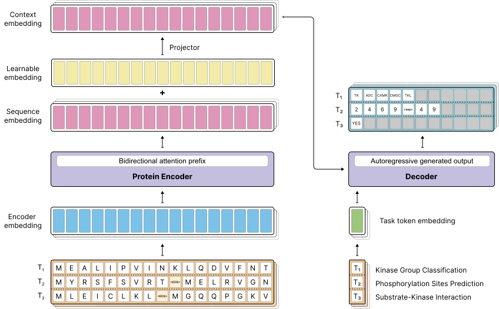

<h2>Predicting Kinase-Substrate Phosphorylation Site Using Autoregressive Transformer</h2>

**Mahdi Pourmirzaei**1 3 &dagger; · **Farzaneh Esmaili**1 &dagger; · **Mohammadreza Pourmirzaei**
2  · **Mohsen Rezaei** 1 · **Dong Xu**1*

1University of Missouri&emsp;&emsp;&emsp;&emsp;2Politecnico di Milano&emsp;&emsp;&emsp;&emsp;
3ProGene

&dagger;Equal contribution&emsp;*corresponding author

<strong>Abstract</strong>: Protein phosphorylation is a critical post-translational modification regulating cellular 
processes, yet accurately predicting kinase-specific phosphorylation sites remains challenging due to the vast diversity
of kinases and the contextual complexity of substrate recognition. In this work, we introduce a unified model that 
integrates a pre-trained protein language model with an autoregressive transformer decoder to address three kinase 
phosphorylation-related tasks directly from substrate and kinase sequences. To overcome the primary limitation of 
autoregressive decoding in phosphorylation site prediction, we incorporate a self-supervised pre-training stage,
removing that limitation and achieving state-of-the-art results in substrate-kinase phosphorylation site prediction,
surpassing existing methods by a large margin. Additionally, our framework supports kinase group classification and 
substrate-kinase interaction prediction as auxiliary tasks, further improving model applicability in real-world 
biological research. Our results highlight the potential of leveraging generative AI for precise phosphorylation
site prediction. The code and model are available 

Checkout the main repository [here](https://github.com/mahdip72/prot2token?tab=readme-ov-file#prediction-tutorial)
to use python package for predicting kinase-substrate phosphorylation site.